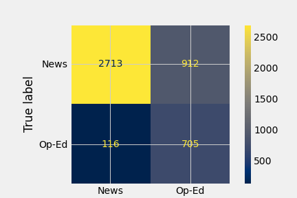

# Classifying "Op-Ed" vs "News"

## Background:
##### Format matters. As the modern consumer is bombarded with news and opinion from multiple sources via multiple formats it is becoming increasingly difficult for a consumer to distinguish what they should take as fact from what they should, by design, read as an opinion. I was interested in building a model that classified stories written for the "Op-Ed" desk and those written for the "News" desk, the two formats that coexist in every newsroom, print or broadcast.

## Objectives:

##### 1. Build a classification model that predicts "Op-Ed" from "News" pieces using NLP on the body of the articles themselves.
---

---
## The Data:
##### 1990-2020. Print. Keyword='United States Politics and Government'.

News: 31792 Oped: 7678, Total: 39470, Op-Ed 0.19 of total

## The Vectorizer:
Number of features: 163, Numbers of stop words: 103201
analyzer: word
binary: False
decode_error: strict
dtype: <class 'numpy.float64'>
encoding: utf-8
input: content
lowercase: True
max_df: 1.0
max_features: None
min_df: 0.4
ngram_range: (1, 1)
norm: l2
preprocessor: <function punc_strip at 0x7f837faf3440>
smooth_idf: True
stop_words: ['a', 'b', 'c', 'd', 'e', 'f', 'g', 'h', 'i', 'j', 'k', 'l', 'm', 'n', 'o', 'p', 'q', 'r', 's', 't', 'u', 'v', 'w', 'x', 'y', 'z']
strip_accents: None
sublinear_tf: False
token_pattern: (?u)\b\w\w+\b
tokenizer: <function wordnet_tokenize at 0x7f837faf3200>
use_idf: True
vocabulary: None
## The Model:

## Model Performance: 

## Analysis:

said                
mr                  
our                 
should

---
## The Data:
##### 2000-2020. Print. Keyword='United States Politics and Government'.

News: 31792 Oped: 7678, Total: 39470, Op-Ed 0.19 of total

---
## The Vectorizer:
Number of features: 164, Numbers of stop words: 103201
analyzer: word
binary: False
decode_error: strict
dtype: <class 'numpy.float64'>
encoding: utf-8
input: content
lowercase: True
max_df: 1.0
max_features: None
min_df: 0.4
ngram_range: (1, 1)
norm: l2
preprocessor: <function punc_strip at 0x7f9e8bbc5cb0>
smooth_idf: True
stop_words: ['a', 'b', 'c', 'd', 'e', 'f', 'g', 'h', 'i', 'j', 'k', 'l', 'm', 'n', 'o', 'p', 'q', 'r', 's', 't', 'u', 'v', 'w', 'x', 'y', 'z']
strip_accents: None
sublinear_tf: False
token_pattern: (?u)\b\w\w+\b
tokenizer: <function wordnet_tokenize at 0x7f9e8bbc5680>
use_idf: True
vocabulary: None

## The Model:

## Model Performance: 

Accuracy: 0.91
Recall: 0.91
Precision: 0.7
TN:7220 FP:743 FN:175 TP:1730

## Analysis:
said                
mr                  
our                 
should

---
## The Vectorizer:
Number of features: 233, Numbers of stop words: 95567
analyzer: word
binary: False
decode_error: strict
dtype: <class 'numpy.float64'>
encoding: utf-8
input: content
lowercase: True
max_df: 1.0
max_features: None
min_df: 0.3
ngram_range: (1, 1)
norm: l2
preprocessor: <function punc_strip at 0x7fa7d05d2050>
smooth_idf: True
stop_words: ['a', 'b', 'c', 'd', 'e', 'f', 'g', 'h', 'i', 'j', 'k', 'l', 'm', 'n', 'o', 'p', 'q', 'r', 's', 't', 'u', 'v', 'w', 'x', 'y', 'z']
strip_accents: None
sublinear_tf: False
token_pattern: (?u)\b\w\w+\b
tokenizer: <function wordnet_tokenize at 0x7fa7d05dba70>
use_idf: True
vocabulary: None

## The Model:

## Model Performance: 

Accuracy: 0.91
Recall: 0.92
Precision: 0.69
TN:6567 FP:684 FN:138 TP:1516

## Analysis:
-233 features. pulling out common words to news stories. seems to be words of nuance and attribution. 

---
## The Vectorizer:

Number of features: 422, Numbers of stop words: 95378
analyzer: word
binary: False
decode_error: strict
dtype: <class 'numpy.float64'>
encoding: utf-8
input: content
lowercase: True
max_df: 1.0
max_features: None
min_df: 0.2
ngram_range: (1, 1)
norm: l2
preprocessor: <function punc_strip at 0x7fa7d05d2050>
smooth_idf: True
stop_words: ['a', 'b', 'c', 'd', 'e', 'f', 'g', 'h', 'i', 'j', 'k', 'l', 'm', 'n', 'o', 'p', 'q', 'r', 's', 't', 'u', 'v', 'w', 'x', 'y', 'z']
strip_accents: None
sublinear_tf: False
token_pattern: (?u)\b\w\w+\b
tokenizer: <function wordnet_tokenize at 0x7fa7d05dba70>
use_idf: True
vocabulary: None

## The Model:
RF_CLF
## Model Performance: 
Accuracy: 0.91
Recall: 0.92
Precision: 0.7
TN:6594 FP:657 FN:129 TP:1525

## Analysis:
---
## Next Steps:
.do full year of printed material.
.play w/ document frequency. 

