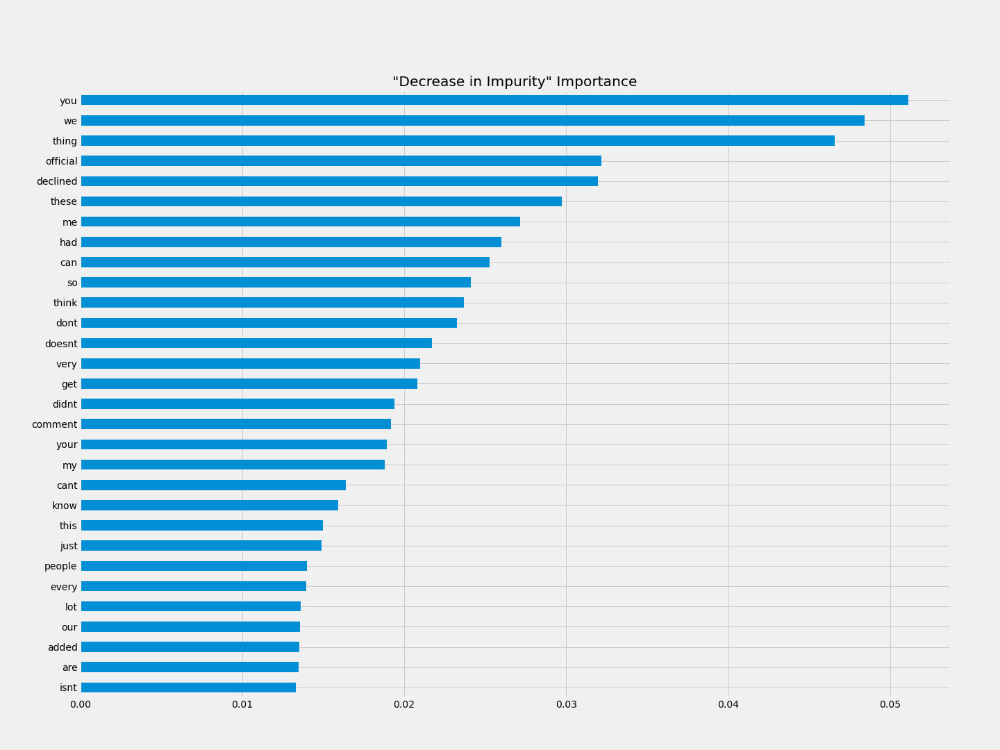

# Classifying "Op-Ed" vs "News"

## Background:
##### Format matters. As the modern consumer is bombarded with news and opinion from multiple sources via multiple formats it is becoming increasingly difficult for a consumer to distinguish what they should take as fact from what they should, by design, read as an opinion. I was interested in building a model that classified stories written for the "Op-Ed" desk and those written for the "News" desk, the two formats that coexist in every newsroom, print or broadcast.

## Objectives:

##### 1. Build a classification model that predicts "Op-Ed" from "News" pieces using NLP on the body of the articles themselves.

## The Data:

##### 2020. Print. Keyword='United States Politics and Government'.

---
## The Model:
stop_words = ['a','b','c','d', 'e', 'f', 'g', 'h', 'i', 'j', 'k', 'l', 'm', 'n', 'o', 'p', 'q', 'r', 's', 't', 'u', 'v', 'w', 'x', 'y', 'z']

## Model Performance: 

accuracy = 0.942458587619878
recall = 0.9021739130434783
precision = 0.7757009345794392
tn:915 fp:48 fn:18 tp:166

## Analysis:

## Next Steps:

