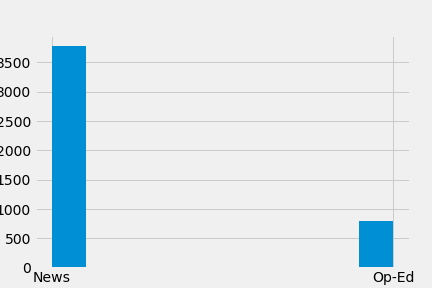
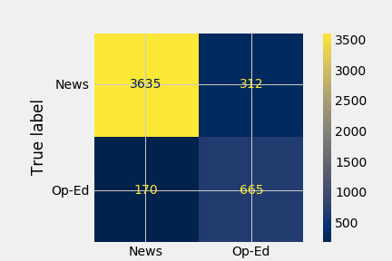
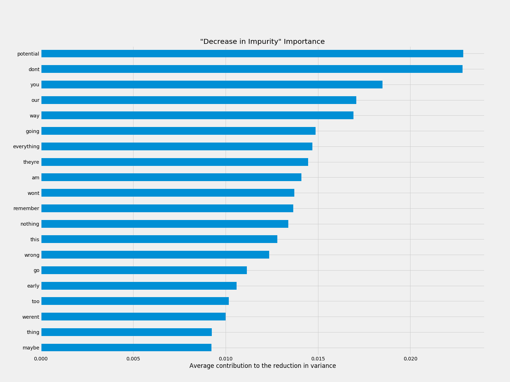
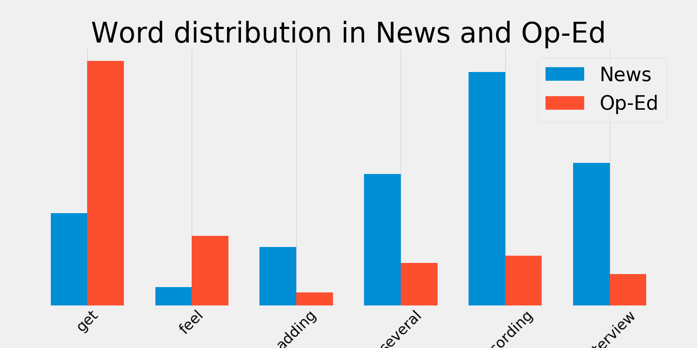

# Classifying "Op-Ed" vs "News"

## Background:

##### Format matters. As the modern consumer is bombarded with news and opinion from multiple sources via multiple formats it is becoming increasingly difficult for a consumer to distinguish what they should take as fact from what they should, by design, read as an opinion. I was interested in building a model that classified stories written for the "Op-Ed" desk and those written for the "News" desk, the two formats that coexist in every newsroom, print or broadcast.

## Objectives:

##### 1. Classify "Op-Ed" vs "News" articles.

## Data:

##### 2017-2020. Printed. Keyword='United States Politics and Government'. word_net.lemmetizer

## TF-IDF Vectorizer:

Number of features: 56122, Numbers of stop words: 42

max_df: 0.9
max_features: None
min_df: 0.1
ngram_range: (1, 1)

stop_words: ['a', 'b', 'c', 'd', 'e', 'f', 'g', 'h', 'i', 'j', 'k', 'l', 'm', 'n', 'o', 'p', 'q', 'r', 's', 't', 'u', 'v', 'w', 'x', 'y', 'z', 'see', 'all', 'much', 'if', 'many', 'former', 'chief', 'spokesman']

tokenizer: <function wordnet_tokenize at 0x7fafefaef560>

---
## Model:

## Model Performance: 

Accuracy: 0.92
Recall: 0.9
Precision: 0.72

## Analysis:

## Next Steps:
.do full year of printed material.

