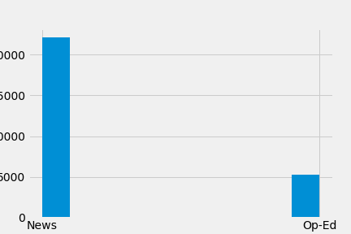

# 
 Classifying "Op-Ed" vs "News" 

### Background:

I have always been fascinated by language, history, and media. During a childhood family vacation to Washington DC, I was mesmerized by the actualization of the Library of Congress, a building devoted to the artifacts that most closely speak to Americans. I was inspired at seeing family names hand written in a fancy, enormous microfilm projector at the National Archives. 

Founded in 1851, The New York Times has long been regarded within the industry as our national "newspaper of records". As the city and our nation has matured and suffered, progressed and regressed, experienced solidarity and schism; everyday has been recorded by the journalists of The New York Times. Over nearly two centuries, the Times has daily turned current events into American History. And though America’s memory is short, the language we use today has been formed by this historical record.

### Motivation 

The modern New Yorker is bombarded with news and opinion from multiple sources via multiple formats via multiple mediums. This modern benifit has made it all but impossible for readers to understand which messages are meant to inform, and which are meant to influence. The modern problem is that the signal is being lost in the noise.

###  Goal

With the use of NLP and ML my goal is to gain insights into ways this formative document informs and influeces its readers and use those insights to classify opinion from news.

## Data:

##### 2017-2020. Printed. Keyword='United States Politics and Government'.

### Data Engineering: 

### TF-IDF Vectorizer:

**Number of features: 56122, Numbers of stop words: 42**

*max_df: 0.9*
*max_features: None*
*min_df: 0.1*
*ngram_range: (1, 1)*

*stop_words: ['a', 'b', 'c', 'd', 'e', 'f', 'g', 'h', 'i', 'j', 'k', 'l', 'm', 'n', 'o', 'p', 'q', 'r', 's', 't', 'u', 'v', 'w', 'x', 'y', 'z', 'see', 'all', 'much', 'if', 'many', 'former', 'chief', 'spokesman']*

*tokenizer: <function wordnet_tokenize at 0x7fafefaef560>*

## Model: Random Forest Classifier

### Model Performance: 

*Accuracy: 0.92*
*Recall: 0.9*
*Precision: 0.72*

### Analysis:

## Next Steps:
- POS Tagger
- n-grams
- NLP on removed quotations

